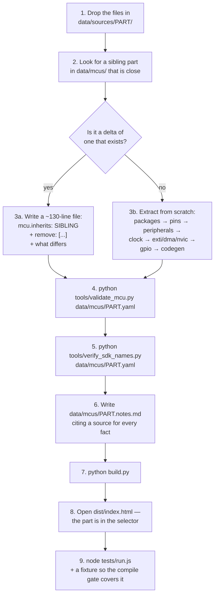
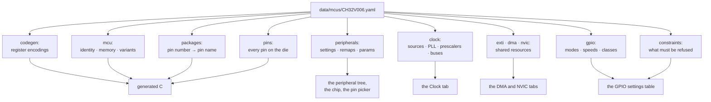

# Adding a microcontroller

This project ships **CH32V006**, **CH32V005**, **CH32V003** and **CH32X035** — which is really
just "whatever is in `data/mcus/`". If the part you want is not in that list, this page is the
whole process.

The honest summary: **adding a part is a data job, not a programming job.** You supply the
vendor's documentation; an AI agent — or you — extracts it into one YAML file; the app, the
generated C and every test pick it up with **no engine change**. That claim is enforced by
`tests/no_part_names.test.js`, which fails the build if any part number appears in `app/`.

---

## What you need

Three things per part, all from the vendor. In order of usefulness:

| # | What | Where to get it | Why it matters |
|---|---|---|---|
| 1 | **The EVT package** | WCH's site, or the chip's product page | **The highest authority.** It is the SDK the generated code must compile against — register names, SPL function names, enum members, startup code, and worked examples. If the code names a macro, it must exist in here. |
| 2 | **The Reference Manual** (RM) | Same | The register-level truth: remap field positions, DMA request tables, interrupt vector tables, clock tree. |
| 3 | **The Datasheet** (DS) | Same | Pin tables per package, the model/ordering table, electrical limits, and the notes — which is where the *gotchas* live (shorted pins, package-specific reset pins, per-pin restrictions). |

**Convert the PDFs to Markdown.** The markdown is what everything here reads — the extraction
tools, the agents, the diffs and you: it greps, it can be cited by line, and a second pass can
check it. **Keep the original PDFs beside the conversions anyway**, because it is the last
resort: the CH32X035 DMA request map was recovered from the PDF after the conversion destroyed
a table, and CH32L103's pin table needs it for the `-` placeholder cells the conversion drops.

The order is a rule, not a preference — **markdown first, PDF last** — and a fallback has to
earn itself:

1. read the markdown; if the table parses, that is the answer;
2. open the PDF only when the conversion **demonstrably** cannot answer — missing, unreadable,
   or a table it destroyed — never because it looks clearer;
3. when you do: say why in a `PDF FALLBACK:` line in the tool, recover **by script**, and check
   the result against numbers the datasheet states elsewhere (pin numbers running 1..N, the
   model table's I/O count per package, the surviving row order). A plausible-looking wrong
   table is the one outcome worse than no table;
4. write the recovered cells into a declared file beside the conversion, cite it in
   `<PART>.notes.md` together with the PDF's table, and never open that PDF again.

`tools/source_docs.py` implements that order for the tools, `data/sources/README.md` is the long
form, and `tests/source_order.test.js` fails the build if a PDF in a `Datasheets/` folder has no
conversion beside it or if a script opens one without saying why.

> **The DS conversion is often mangled — that is normal, and it is step 5 below, not a reason to
> reach for the PDF.** For CH32X035, pin rows split across lines and all seven package columns
> merged into single cells. Expect it, and expect that a *parser plus a second-pass diff* is what
> fixes most of it; the part a parser cannot fix is the part that earns the PDF. Eyeballing a
> mangled table is how a wrong pin count ships.

## Where the files go

```
data/sources/<PART>/
├── Datasheets/
│   ├── <PART>DS0.md      the datasheet, as markdown   <- read THIS first
│   ├── <PART>DS0.pdf     the original, kept for the last resort
│   ├── <PART>RM.md       the reference manual, as markdown
│   ├── <PART>RM.pdf      the original
│   └── *_corrections.yaml   cells recovered from the PDF, declared and cited
└── Evt/                  the vendor package, unzipped, exactly as shipped
    └── EXAM/SRC/Peripheral/inc/*.h    <- the headers the tools actually read
```

`<PART>` is the family name the YAML will use — `V006`, `X035`, `V003`. Existing folders use
`Datasheets/` and `Evt/`; `V003` arrived as `datasheets/` and `evt/`. The tools search
recursively and case-insensitively for `Peripheral/inc`, so either works — but match the
existing spelling if you want the tree to look tidy.

Whatever the vendor provides, provide all of it. The EVT packages here are 988 and 2 239 files
respectively, and `verify_sdk_names.py` walks them.

## The process



Steps 3b and 6 are the work. Everything else is a command.

### Asking an AI to do the extraction

This is how the parts in this repo were actually built, and it works well **provided you give it
the constraints**. A prompt that produces usable output looks roughly like:

> Read `data/sources/V003/datasheets/CH32V003.md` and the headers under
> `data/sources/V003/evt/EXAM/SRC/Peripheral/inc/`.
>
> Produce `data/mcus/CH32V003.yaml` in the format documented in `data/FORMAT.md`. Use
> `data/mcus/CH32V006.yaml` as the worked example of the format, **not as a source of facts**.
>
> For every fact, cite the DS table or the `file:line` you read it from, in
> `data/mcus/CH32V003.notes.md`. If the source does not state something, put it in the notes as
> an open question — **do not infer it from a sibling part.** A family is not a citation.
>
> Then run `python tools/validate_mcu.py data/mcus/CH32V003.yaml` and
> `python tools/verify_sdk_names.py data/mcus/CH32V003.yaml` and fix what they report.
>
> Read the **markdown** only — the PDF is the last resort and you do not open it by eye. If a
> table the YAML needs is destroyed by the conversion (dropped columns, lost placeholder
> cells), say which table and what is missing, and stop there; that is a `tools/recover_*.py`
> job with its own checks, not a reading exercise.

That last paragraph is the important one. Without it you will get a file that parses, validates,
looks entirely plausible, and contains a mode the silicon does not have.

### The trap, and it is a real one

The fastest way to produce a wrong part file is to copy a sibling and change the numbers. This
project has shipped that bug **three times**, once per round:


The three, all now guarded:

| Copy-paste defect | Consequence |
|---|---|
| `8` GPIO modes → a part with `6` | The GPIO table offered open-drain on a chip that has no open-drain |
| `GPIO_Speed_50MHz` → a part whose only speed is `30MHz` | Generated C would not compile |
| `codegen.header: ch32v00x.h` → the part needs `ch32v00X.h` | Included the wrong chip's header (and compiled on Windows because filenames are case-insensitive there) |

**The countermeasure is the gate, not care.** `verify_sdk_names.py` asks each part's *own*
headers whether a name exists. Write the file from the sources, then let the tool tell you where
you were wrong.

---

## What the extracted file looks like

One file, `data/mcus/<PART>.yaml`, plus a `<PART>.notes.md` beside it. The blocks are
independent — a missing optional block makes the app go quiet in one specific place rather than
breaking.



### `mcu:` — identity, and the part numbers people order

```yaml
mcu:
  name: CH32V006
  vendor: WCH
  family: CH32V00x
  core: QingKe RISC-V2A (RV32EmC)
  flash_kb: 62
  sram_kb: 8
  vdd_v: [2.0, 5.5]
  max_sysclk_mhz: 48
  default_package: TSSOP20
  variants:
    CH32V006F8P7: { package: TSSOP20, flash_kb: 62, sram_kb: 8, temp: 105, io_count: 18,
                    pio_board: genericCH32V006F8P6, pio_env: CH32V006F8P6 }
```

`variants:` is the datasheet's ordering table, one row per orderable part, and it drives the New
Project dialog. `io_count` is the **datasheet's own I/O column** — the validator counts the
package table and fails if they disagree, which is what catches a dropped or duplicated row.

`pio_board` / `pio_env` are **not derivable from the part number** and must never be guessed.
Board files ship the 85 °C grades while plenty of orderable parts are 105 °C, so `CH32V006F8P7`
legitimately builds with `genericCH32V006F8P6`. A part with no board **says nothing** here, and
the app then refuses to generate a project for it rather than substituting a neighbour that
would lie about the flash size.

### `packages:` — pin number → pin name, one table per package

```yaml
packages:
  TSSOP20:
    1: PD4
    4: [PD7, PA4]      # internally shorted: ONE physical pin, two names
    7: VSS
  QFN20:
    0: VSS             # pin 0 is the exposed pad, only on packages that have one
```

A **list** value means those GPIOs are bonded together inside the package. The app treats them
as one physical pin, so a signal on either name claims it — and that is what makes the shorted-
pin conflict rules work. This comes from the datasheet's **notes**, not its pin table; look for
it deliberately.

The validator enforces that numbered pins run `1..N` with no gaps, that `N` matches the geometry
in `data/packages/packages.yaml` (or the chip cannot be drawn), and that every name exists in
`pins:`.

### `pins:` — every pin that exists on the die

```yaml
pins:
  VDD:  { type: power }
  PA1:  { type: io, analog: true, notes: XI when HSE used (AFIO PA12_RM) }
```

`type` is one of `io`, `power`, `ground`, `reset`, `boot`, `sys`, `nc`, `analog`. Only `io`
pins are assignable.

> **Ports are not all the same shape, and two assumptions have already broken things.**
> CH32V006 has 16-bit ports; **CH32X035 has 24-bit ports** (`GPIO_Pin_0 … GPIO_Pin_23`) and its
> port C is **not contiguous** — PC0–PC7, PC10–PC11, PC14–PC19, with two holes. So:
> never write a 16-bit mask, and never iterate a port `0..max` — iterate the names in `pins:`.
> There is a test named "a port with a hole in it is not iterated as a range".

### `peripherals:` — the important one

```yaml
peripherals:
  USART1:
    category: Connectivity
    settings:
      - name: Mode
        type: choice                      # or `checkboxes` for a multi-select
        choices:
          - { name: Disable }             # choices[0] is ALWAYS the off state
          - { name: Asynchronous, signals: [TX, RX] }
          - { name: Synchronous,  signals: [TX, RX, CK] }
      - name: Hardware Flow Control
        choices:
          - { name: Disable }
          - { name: CTS/RTS, signals: [CTS, RTS] }
    remaps:                               # entry 0 = the default mapping, entry 1 = field reads 1
      - name: Default
        pins: { CK: PB9, CTS: PC16, RTS: PC17, RX: PB11, TX: PB10 }
      - name: Partial remap 1
        macro: GPIO_PartialRemap1_USART1  # only where the family applies remaps by macro
        pins: { CK: PB9, CTS: PC16, RTS: PC17, RX: PA11, TX: PA10 }
      - name: Full remap
        macro: GPIO_FullRemap_USART1
        pins: { CK: PB12, CTS: PA13, RTS: PA14, RX: PB2, TX: PA7 }
    remap_by_package: { QFN12: 0, QSOP24: 1 }   # optional: forces a remap per package
```

Rules, and every one of them is load-bearing:

1. **`choices[0]` is the off state.** The engine decides whether a peripheral is enabled by asking
   whether *any* setting has left its first choice. Put `Disable` first. If the first choice
   legitimately claims a pin — CH32V006's external reset does — say why in a comment rather than
   reordering something physically true.
2. **The remap's POSITION in the list is the register field value.** Entry 0 is the default
   mapping, entry 1 is what you get when the AFIO field reads 1. The `name:` is a display label
   and carries no meaning, which is why the two files here spell it differently (`Default` in one,
   `"0000 Default"` in another). **Keep the order.**
3. **Every remap must offer the same signal keys.** A signal present in one remap and missing from
   another silently disappears when the user switches remaps. The validator rejects it.
4. **Every signal a choice can request must be routed by some remap**, or that choice can never be
   satisfied. The validator rejects that too.

A signal two features share is modelled **once**. CH32V006's TIM2 routes `CH1_ETR` as a single
signal, because channel 1 and the external trigger are the same physical pin.

**Remaps by macro vs by register.** Some families do not expose the AFIO field at all and instead
ship named macros. CH32X035 has 40 of them, applied with one SDK call each, and names them per
remap entry as above. `codegen.remap.style` tells the generator which route the part takes:

| `codegen.remap.style` | The generator emits | Used by |
|---|---|---|
| `register` (default) | the `AFIO->PCFR1` word, built from `fields` with `lsb`/`bits` | CH32V006, CH32V005 |
| `macro` | `GPIO_PinRemapConfig(<macro>, ENABLE)` per enabled peripheral | CH32X035 |

An index with **no** `macro:` emits nothing, which is how "no remap" stays silent — note that the
default mapping has no macro on that family, so an entry without one is normal rather than an
omission. Both styles are one rule with no part special-cased, which is why both families generate
from the same code and why adding a third is a data job.

### `params:` — how a peripheral is configured once it has pins

`settings:` answers *which pins does this take*. `params:` answers *how is it configured* — baud
rate, prescaler, polarity. There are two flavours, and which one you use is decided by the SDK,
not by taste:

```yaml
    params:
      # A member of the peripheral's init struct: the generator fills a field.
      - key: baud
        name: Baud rate
        struct: USART_InitTypeDef
        sdk_field: USART_BaudRate
        type: int
        default: 115200
        min: 110
        max: 3000000
        unit: Bd
        help: "Ceiling is fCK/16, so 3 MBd at 48 MHz. USART_BRR."

      - key: parity
        name: Parity
        struct: USART_InitTypeDef
        sdk_field: USART_Parity
        type: enum
        default: "None"
        options:
          - { name: "None", value: 0, sdk: USART_Parity_No }
          - { name: Even,   value: 2, sdk: USART_Parity_Even }
          - { name: Odd,    value: 3, sdk: USART_Parity_Odd }
        help: "USART_CTLR1 PCE (bit 10) and PS (bit 9)."

      # No init struct at all: the SDK configures this by CALLING A FUNCTION.
      # IWDG is the worked example - it has no IWDG_InitTypeDef.
      - key: prescaler
        name: Prescaler
        sdk_call: IWDG_SetPrescaler
        sdk_args: [$VALUE]
        type: enum
        default: "64"
        options:
          - { name: "4",  value: 0, sdk: IWDG_Prescaler_4 }
          - { name: "64", value: 4, sdk: IWDG_Prescaler_64 }
        help: "Divides the LSI. The header stops at 256 - there is no IWDG_Prescaler_512 on this part, however familiar that name is elsewhere."
```

Notes that matter:

- **`options[].value` is the register encoding and `options[].sdk` is the macro.** Codegen emits
  the macro, never the number — and a test asserts that, because emitting a plausible-looking
  literal instead of an enum member is exactly the class of defect a compiler cannot catch.
- **`struct` + `sdk_field` OR `sdk_call` + `sdk_args`**, never a mix. The first fills a
  `*_InitTypeDef`; the second emits one call per occurrence. The generator decides from the data,
  not from the peripheral's name.
- **A parameter never claims a pin.** Which is why the conflict engine can ignore this block
  entirely. Anything that changes *which pin* is used is a `settings` entry with `signals:`, not
  a parameter. The USART's hardware flow control is a setting for exactly this reason, and the
  file says so in a comment.
- **Order is the file's order.** A parameter list written top-to-bottom is easier to keep right
  than a second mechanism saying when to ignore it. `group:` can split a long list into Basic and
  Advanced.

### `clock:` — the Clock Configuration tab

```yaml
clock:
  sources:
    HSI: { mhz: 24, fixed: true }                     # DS: an internal RC, not adjustable
    HSE: { mhz: 24, min_mhz: 3, max_mhz: 32 }         # an editable crystal, bounded by the DS
    LSI: { khz: 128, fixed: true }
  pll:
    inputs:
      - { name: HSI, source: HSI, div: 1 }
      - { name: HSE, source: HSE, div: 1 }
    multipliers: [2]
  sysclk:
    sources: [HSI, HSE, PLLCLK]
    max_mhz: 48
  prescalers:
    HB:  { options: [1, 2, 3, 4, 5, 6, 7, 8, 16, 32, 64, 128, 256],
           max_mhz: 48, label: HB prescaler (HPRE) → HCLK }
    ADC: { options: [1, 2, 4, 6, 8, 12, 16, 24, 32, 48, 64, 96, 128], source: HB,
           min_mhz: 16, max_mhz: 48, label: "ADC prescaler (ADCPRE; /1 = ADC_CLK_MODE)" }
  derived:                                            # informational taps, not settings
    - { name: Flash time base, source: HB, div: 3 }
    - { name: Core SysTick,    source: HB, div: 8 }
  buses:
    HB: [TIM1, TIM2, TIM3, GPIO, AFIO, USART1, USART2, I2C1, SPI1, ADC1, TKEY, DMA1, WWDG, OPA1, PWR]
  hse_peripheral: RCC
  hse_setting: High Speed Clock (HSE)
  hse_signals: [XI, XO]
  notes: >
    Free prose for the Clock tab, and the place to record a wrong reading you corrected.
```

The tab is drawn entirely from this block, which is why a part with **no HSE** simply has no HSE
box — no placeholder, no greyed control, and no code change.

The three `hse_*` keys are the coupling that makes it behave like CubeMX: picking HSE anywhere in
the tree (as SYSCLK's source **or** the PLL's) switches that setting on and lets its crystal
choice claim its pins through the ordinary conflict engine. `hse_setting` names the setting, and
`hse_signals` names the signals the crystal claims — so `XI`/`XO` is data, never a constant in
the code. The synthetic test fixture deliberately calls the same two pins `OSC_IN`/`OSC_OUT`, so
a hardcoded assumption cannot hide.

Two smaller things worth knowing:

- **`max_mhz` is what reddens a box**, not a hard limit. An out-of-datasheet crystal is accepted,
  shown red, and reported — never refused, because the user's board may legitimately be unusual.
  This field said 25 for a while; 25 is the ESR recommendation for one crystal in a table
  footnote, not a ceiling. The real limits are DS Tables 3-9 and 3-10.
- **`notes:` is prose and is the right home for a correction**, including a wrong reading you
  fixed yourself. Several of the longest notes in these files exist because a number was wrong
  once and the reasoning is worth keeping.

### `exti:` · `dma:` · `nvic:` — the shared resources

These are the things that are neither a pin nor a peripheral, but can still collide. They are
where a part's *shape* differs most, so read them carefully.

**EXTI — which pin each interrupt line can come from.** Condensed from CH32V006:

```yaml
exti:
  register: { name: AFIO_EXTICR, address: 0x40010008, bits_per_line: 2, reset: 0x00000000 }
  lines:                            # key is the 2-bit AFIO_EXTICR field value
    EXTI0: { "00": PA0, "01": PB0, "10": PC0, "11": PD0 }
    EXTI7: { "00": PA7,             "10": PC7, "11": PD7 }   # no PB7 — "01" selects nothing
  internal:                         # RM Table 6-2 — no pin, cannot conflict
    EXTI8: { event: PVD — supply crossed the voltage-monitoring threshold }
    EXTI9: { event: Automatic wake-up }
  interrupt: EXTI7_0 — one vector for lines 0-7 (RM Table 6-1, vector 20)
```

Line *x* can only ever reach pin number *x* — `EXTI3` reaches `PA3`/`PB3`/`PC3`/`PD3` and
nothing else. That is why `lines` is keyed by line, and why a port missing the pin simply omits
the key: **two ports on one line is the conflict** (`AFIO_EXTICR` can only select one), which is
a different thing from a pin conflict.

**DMA — which channel serves which request.** Note the direction of the map: it is keyed by
**channel**, and each channel lists the requests it can serve. One channel serves several
peripherals, which is how a channel clash becomes detectable at all.

```yaml
dma:
  controller: DMA1
  channels: 7
  requests:
    1: [ADC1, TIM2_CH3, TIM3_CH3]
    4: [USART1_TX, TIM1_TRIG, TIM1_COM, TIM1_CH4, TIM3_CH4]
    7: [I2C1_RX, TIM2_CH2, TIM2_CH4, USART2_RX]
  init_struct: DMA_InitTypeDef
  register: { name: DMA_CFGRx, address: 0x40020008, stride: 20, channel_macro: DMA1_Channel$CH, fields: { … } }
  channel_params: [ … ]             # the DMA_InitTypeDef fields, same schema as params:
  request_defaults: { USART1_TX: { priority: Medium, … } }
```

`channel_params` is deliberately the **same schema** as a peripheral's `params:`, which is why
the Parameter Settings editors render the DMA tab with no new UI code.

**NVIC — every interrupt vector, and the core's priority scheme.**

```yaml
nvic:
  controller: PFIC
  scheme:
    priority_bits: 2                # CH32X035 has THREE; these are QingKe cores, not Cortex-M
    priority_lsb: 6                 # [5:0] are reserved and write-invalid
    max_nesting: 2
    groups:
      - name: 2 levels of nesting (1 preemption bit, 1 sub-priority bit)
        default: true               # `default: true`, not "the first one"
        preempt: { bits: 1, lsb: 7, min: 0, max: 1 }
        sub:     { bits: 1, lsb: 6, min: 0, max: 1 }
      - name: No nesting (2 priority bits, no preemption)
        preempt: { bits: 0, min: 0, max: 0 }
        sub:     { bits: 2, lsb: 6, min: 0, max: 3 }
    enable: { register: PFIC_IENR1, address: 0xE000E100 }
  vectors:
    - { name: USART1,  vector: 32, irqn: USART1_IRQn,  handler: USART1_IRQHandler,  peripheral: USART1 }
    - { name: EXTI7_0, vector: 20, irqn: EXTI7_0_IRQn, handler: EXTI7_0_IRQHandler, peripheral: EXTI, lines: [0, 7] }
```

Four things here are not guessable, and each has caught somebody:

- **`vector` is the RM's vector-table index**, not an arbitrary id. It is also what the SDK's
  `IRQn` enum uses.
- **`irqn` and `handler` are two different names, and they are not interchangeable.** `irqn` is
  the `IRQn_Type` member that `NVIC_InitStructure` takes; `handler` is the symbol the startup
  table expects your ISR to be called. The vendor is inconsistent between them — vector 29 is
  `ADC_IRQn` in the enum but `ADC1_IRQHandler` in the startup table. This file once claimed
  `ADC1_IRQn`, which exists in **neither**, so generated NVIC code would not have compiled. Take
  both mechanically from the EVT package; do not transcribe.
- **`lines: [first, last]` is an inclusive RANGE, not a list of numbers.** That is how a *grouped*
  EXTI vector is expressed: CH32X035 has three vectors covering 26 EXTI lines between them
  (`[0,7]`, `[8,15]`, `[16,25]`), so the NVIC tab lists three rows rather than twenty-six. The
  engine maps **line → vector**, which is the direction every question is actually asked in:
  *"the user made PA3 an external interrupt, which vector has to be on?"*. CH32V006's single
  `EXTI7_0` uses the same key, so the UI has one code path and not two.
- **And the vector list may simply be incomplete in the manual.** CH32V006's RM Table 6-1 has no
  TIM3 vector although the part has a TIM3. The file records that as an open question rather
  than inventing an entry — which is the correct outcome, and the notes say exactly what to check
  if a newer header turns up.

### `gpio:` — what the GPIO block on *this* part actually offers

```yaml
gpio:
  speeds:
    - { name: "50 MHz", macro: GPIO_Speed_50MHz }

  modes:
    - { name: Output Push Pull,             macro: GPIO_Mode_Out_PP, class: out }
    - { name: Alternate Function Push Pull, macro: GPIO_Mode_AF_PP, class: out }
    - { name: Analog,                       macro: GPIO_Mode_AIN,    class: analog }

  input_modes:                                  # keyed by PULL, not by a fourth mode
    - { name: No pull,   macro: GPIO_Mode_IN_FLOATING }
    - { name: Pull-up,   macro: GPIO_Mode_IPU }
    - { name: Pull-down, macro: GPIO_Mode_IPD }
```

That is CH32X035 verbatim, and it is worth reading carefully because it is the block that
caused the most trouble:

- **`modes` has three entries, not the usual eight.** This part has **no open-drain at all**;
  `GPIOMode_TypeDef` has exactly `AIN`, `IN_FLOATING`, `IPD`, `IPU`, `Out_PP` and `AF_PP`. The
  entries that *were* here were `GPIO_Mode_Out_OD` and `GPIO_Mode_AF_OD` — real, correctly
  spelled SPL names belonging to a different chip, which is precisely why only a per-part header
  check can catch them.
- **`input_modes` is keyed by the pull name**, not by a mode called "Input". The SPL folds the
  pull into the mode macro, so there is no single input mode to name. The UI synthesises the
  `Input` row from this list.
- **`class:` is a closed set — `out`, `in`, `analog`.** It exists so a constraint can say *"no
  output function"* once instead of listing mode names that go stale the day a mode is added.
- **A one-entry `speeds` list means the control is not drawn at all.** The speed is shown as
  fixed text, not a one-item dropdown.

### `codegen:` — the encodings the generator cannot derive

```yaml
codegen:
  header: ch32x035.h                # the SDK header generated C includes

  sdk:
    evt: X035                       # data/sources/X035/Evt
    series: ch32x035                # framework-wch-noneos-sdk/Peripheral/<series>/inc

  # APB2 here; CH32V00x spells it PB2. Two live spellings is the point — neither can
  # be hardcoded in the generator.
  gpio_clock: { fn: RCC_APB2PeriphClockCmd, port: RCC_APB2Periph_GPIO$PORT, afio: RCC_APB2Periph_AFIO }

  # Which ROUTE this part takes for remaps. `macro` = one SDK call per peripheral;
  # `register` = build the AFIO word from `fields` using lsb/bits.
  remap:
    style: macro
    fn: GPIO_PinRemapConfig
    enable: ENABLE

  # The struct -> apply-function map. A struct with no entry here cannot be emitted.
  init_structs:
    GPIO_InitTypeDef:        { fn: GPIO_Init }
    USART_InitTypeDef:       { fn: USART_Init }
    DMA_InitTypeDef:         { fn: DMA_Init }
    TIM_TimeBaseInitTypeDef: { fn: TIM_TimeBaseInit }

  periph_handle: { DMA1: DMA1, USBFS: USBFSD, USART1: USART1, TIM1: TIM1 }

  rcc:
    register: "RCC->CFGR0"
    mco: { peripheral: RCC, setting: Master Clock Output (MCO), lsb: 24, bits: 3,
           values: { Disable: 0, SYSCLK: 4, HSI: 5 } }
    prescalers:
      HB: { lsb: 4, bits: 4, values: { 1: 0, 2: 1, 4: 3, 8: 7, 16: 11, 256: 15 } }

  speeds: { "50 MHz": GPIO_Speed_50MHz }

  # Which clock-enable register and bit a peripheral sits in, grouped by domain.
  periph_clock:
    AHB:
      register: RCC_AHBPCENR
      fn: RCC_AHBPeriphClockCmd
      prefix: RCC_AHBPeriph_
      bits: { DMA1: 0, USBFS: 12, USBPD: 17 }
    APB2:
      register: RCC_APB2PCENR
      fn: RCC_APB2PeriphClockCmd
      prefix: RCC_APB2Periph_
      bits: { AFIO: 0, GPIOA: 2, ADC1: 9, TIM1: 11, SPI1: 12, USART1: 14 }
```

Several of these carry a fact worth understanding rather than copying:

- **`remap.style`** is what makes one generator serve both families with no part special-cased.
  CH32V006 writes `AFIO->PCFR1` directly and carries `lsb`/`bits` per peripheral; CH32X035's EVT
  exposes 40 named macros applied with one call. An index with **no** `macro:` emits nothing,
  which is how "no remap" stays silent.
- **`rcc` on CH32X035 has no `sw` field**, and the absence is the fact: that register has no
  source mux, because the part has exactly one clock source and nothing to switch between. A
  generator that assumes every RCC has a mux finds nothing to write and correctly writes nothing.
- **`periph_clock` is grouped by domain**, because it is not only the bit that differs per
  domain — the register and the *function name* do. This is where CH32V00x's
  `RCC_PB2PeriphClockCmd` and CH32X035's `RCC_APB2PeriphClockCmd` come from.
- **`periph_handle` can be genuinely ambiguous.** CH32X035's USBFS has **two** handles at the same
  base address — `USBFSD` for device and `USBFSH` for host — and which one a call takes depends
  on the mode the user selected. A single entry cannot be right for both, so the file names the
  device handle and records the host case as an **open question** rather than a guess.

Bit positions are the RM's word and only a human re-reading the RM can check them; every *name*
in this block is checked against the part's own headers. Where the data does not supply a name or
a position, the generator emits an explicit `TODO` naming exactly what is missing rather than
plausible-looking code that configures the wrong bits — deliberately, so that "the generated code
is incomplete" and "the generated code is subtly wrong" can never be confused.

### `constraints:` — what the app must refuse to offer

Some choices are legal on the silicon in general but not on *this* pin, or not while *that*
peripheral is on. Those are data, not code:

```yaml
constraints:
  # Case 1 — the choice exists on some pins and not others (an ALLOW-list).
  - id: pull-down-only-on-pa0-pa15-pc16-pc17
    option: gpio.pull
    choices: [Pull-down]
    only_on: [PA0, PA1, … PA15, PC16, PC17]
    reason: "Pull-down is available on PA0-PA15 and PC16-PC17 only."
    source: "ch32x035_gpio.h:33 + CH32X035DS0.md ch.1.4.19 (p.11)"

  # Case 2 — a shorted pair may not be an output function (a DENY-list), and it is
  # genuinely per-PACKAGE: the DS excludes QFN20 and QFN12 by name, where PC16/PC17
  # are bonded and NOT shorted, so driving them is legal there.
  - id: shorted-pc10-pc11-pc16-pc17-not-output
    option: gpio.mode
    classes: [out]                    # "an output function", without listing modes
    not_on: [PC10, PC11, PC16, PC17]
    packages: [LQFP64M, LQFP48, QFN28, QSOP28, TSSOP20]
    reason: "PC10 and PC17 are short-joined inside the chip, as are PC11 and PC16; neither pin of a shorted pair may be configured as an output function."
    source: "CH32X035DS0.md Note 4 (p.19)"

  # Case 3 — conditional on another peripheral's state.
  - id: usb-pc10-pc11-not-driven
    option: gpio.mode
    classes: [out, analog]
    not_on: [PC10, PC11]
    when: { peripheral: USBFS, enabled: true }
    reason: "PC10/PC11 must be floating inputs while USBFS is enabled."
    source: "CH32X035DS0.md Note 4 (p.19)"
```

Three things that example teaches, none of them obvious:

- **`packages:` is not bookkeeping.** Leaving case 2 unscoped would refuse a choice the silicon
  *does* honour on two packages — which is the same defect as offering one it does not. The
  round's rule cuts both ways.
- **Semantics are prohibition only**, deliberately. "PC10/PC11 must be floating inputs while USB
  is on" is written as prohibitions, which leaves exactly `Input` + `No pull`. A positive
  `require:` form would be a second mechanism for a case the first already covers, and two
  mechanisms that can disagree is how the GPIO speed defect shipped twice.
- **A pin not bonded on the current package cannot be configured at all**, so an entry naming it
  is inert there rather than an error.

Three consumers read this and they must agree: the **GPIO table** stops offering the choice *on
that row* (absent, not greyed — greying is for something the part has and cannot use right now);
the **conflict engine** reports a violating configuration as an issue naming the `reason`; and
**codegen** declines and emits a `TODO` rather than emitting a combination the data forbids.

Full rules and the validator's checks are in
[`../data/FORMAT.md`](../data/FORMAT.md#constraints). A part with **no** `constraints:` block
behaves exactly as it did before the block existed.

---

## Checking your work

```bash
python tools/validate_mcu.py data/mcus/YOUR_PART.yaml     # schema + internal consistency
python tools/verify_sdk_names.py data/mcus/YOUR_PART.yaml # every claimed name vs that part's headers
python tools/extract_pins.py                              # re-derive the pin tables and diff
python tools/extract_remaps.py                            # re-derive the remap tables and diff
python build.py && node tests/run.js                      # the gate
```

`extract_pins.py` and `extract_remaps.py` are the second pair of eyes: they parse the datasheet
or the RM **independently** of however the YAML was written, and diff the result. CH32V006's
remap tables were re-derived this way and matched on all 232 pin assignments — that is a much
stronger statement than "the file looks right".

`validate_mcu.py` checks, among other things, that every package has a geometry to draw it with,
that pin numbers run 1..N with no gaps, that every signal a mode can request is routed
somewhere, that remap indices are in range, and that each variant's datasheet I/O count matches
the pin table. Use `--strict` to treat warnings as errors.

## Making the compile gate cover it

The part is usable once it validates. To make it **verified**, add a fixture so the compile gate
actually builds C for it:

1. Add an environment to `data/firmware/platformio.ini` (or confirm one exists).
2. Add a fixture under `tests/fixtures/` that assigns real pins, params, a DMA request and an
   NVIC vector — a default configuration generates an empty function and proves nothing.
3. Run `node tests/run.js`.

`tests/codegen_compile.test.js` will then build the generated C against the real WCH RISC-V
toolchain, and `tests/generated_project.test.js` will build the whole standalone folder in a
temp directory. **That** is the point at which the part is supported rather than merely present.

## Fallbacks, if extraction is not going to happen

You do not have to write the YAML by hand to use the tool on an exotic part:

- **`Open MCU file…`** loads any YAML in the schema straight from disk, without rebuilding — and
  the format is documented precisely so you can write a rough one for a part nobody has
  extracted. A minimal file needs only `mcu:`, `packages:`, `pins:` and `peripherals:`.
- **`mcu.inherits:`** lets you define a part as a delta on one that exists. CH32V005 is CH32V006
  minus TouchKey, TIM3 and QFN32, in about 130 lines instead of 1 600. Maps merge
  (child wins), lists replace wholesale, and `remove:` drops paths from the parent *before* the
  child is merged — that ordering is a fix for a real shipped bug, so read
  [`../data/FORMAT.md`](../data/FORMAT.md#mcuinherits-and-mcuremove--a-part-defined-as-a-delta)
  before relying on it.

## Where to look when it goes wrong

| Symptom | Usually |
|---|---|
| The part does not appear in the selector | The file is not in `data/mcus/`, or `mcu.name` is missing, or `build.py` was not re-run |
| The chip cannot be drawn | The package has no geometry in `data/packages/packages.yaml` |
| A peripheral shows ⊘ | It has no mapping usable on the selected package |
| The DMA or NVIC tab is missing | No `dma:` or `nvic:` block, or nothing is switched on |
| Generated C contains a `TODO` | The data does not supply a name or bit position. The TODO names exactly which |
| Generated C contains `#error` | An unresolved pin conflict. **A conflicted design never generates silently** |
| The GPIO table offers something impossible | A missing `constraints:` entry — see the "trap" above |
| A tool reports a part as NOT CHECKED | The EVT package is absent for that part, so its names cannot be verified. That is reported, never passed silently |
