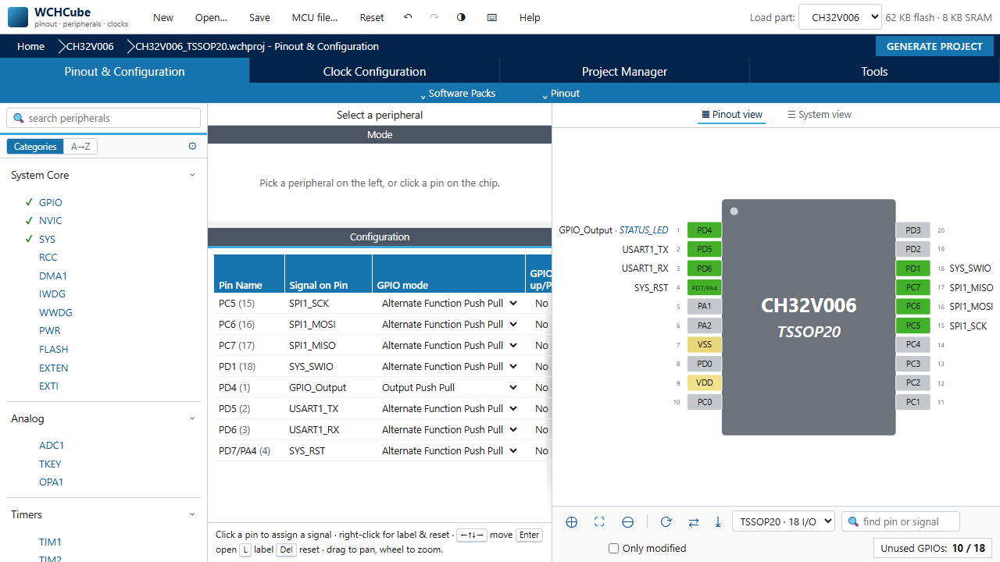
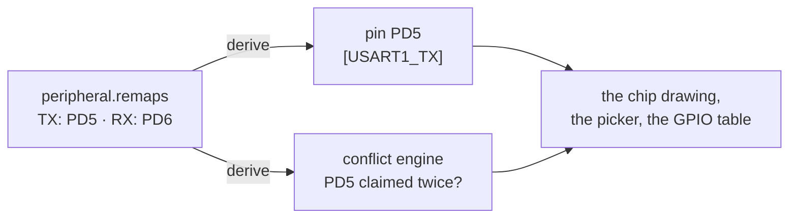
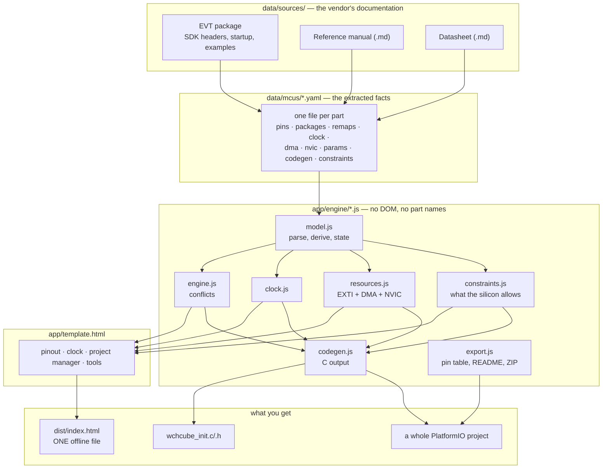
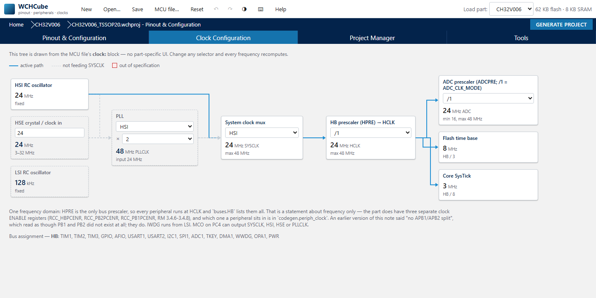
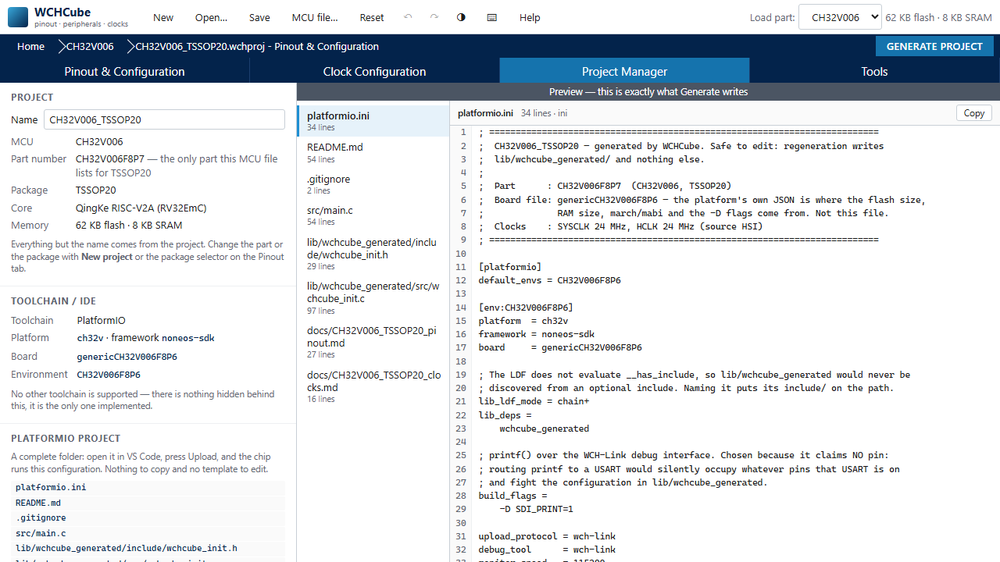
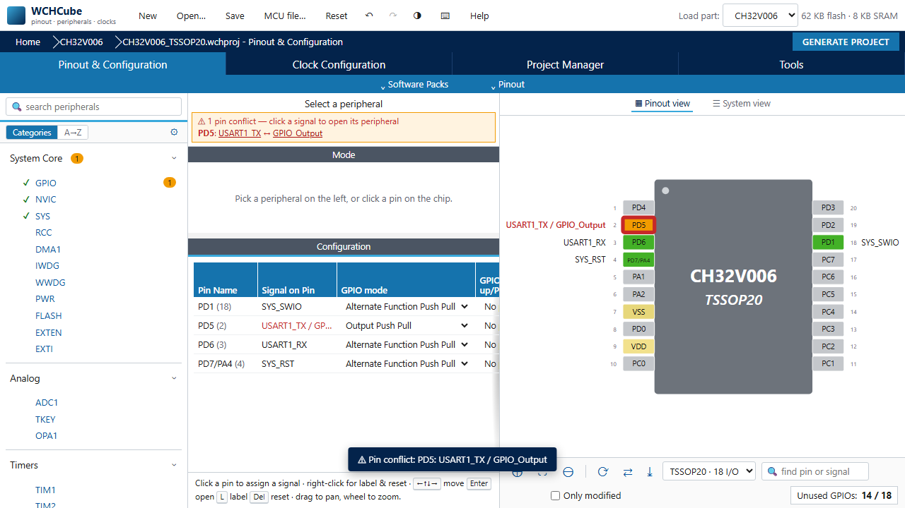
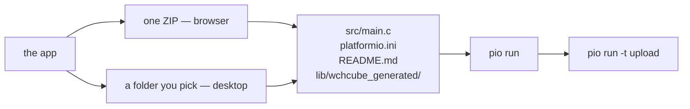
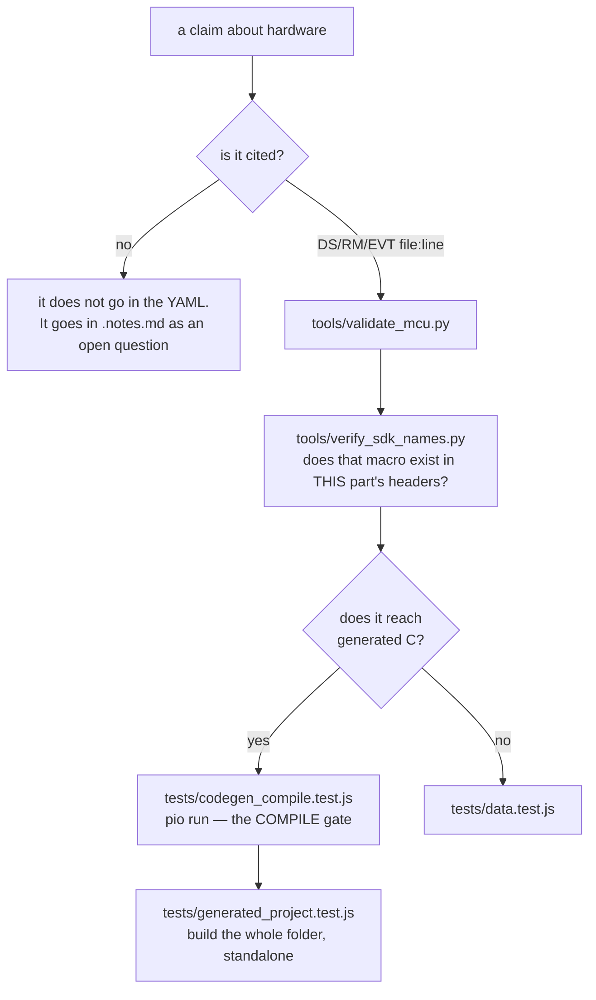

# How WCHCube works

An STM32CubeMX-style pinout, peripheral and clock configurator for **WCH RISC-V
microcontrollers** — pick a part and a package, click a pin, choose a signal. The app tells you
which peripherals can reach which pins *on that exact package*, warns you before a choice
collides with something you already set, and generates C that compiles against WCH's own SDK.

It ships four parts — **CH32V006**, **CH32V005**, **CH32V003** and **CH32X035** — and which parts
exist is simply what is in `data/mcus/`. Adding another does not require touching `app/`.



---

## Read this first: what this project is, and what it isn't

**It is mostly vibe-coded.** That is worth stating plainly rather than discovering from the
commit history, because it changes how you should read everything else here.

The application code was written by AI coding agents — Claude Code sessions — running under a
written working agreement (`agents/README.md`), three at a time, with a human setting direction
and reviewing outcomes. The agents own disjoint parts of the tree, coordinate through an
append-only message board (`agents/BOARD.md`), and are forbidden from asking the human a
question: they make a decision, record it, and continue. Rounds 1 through 4 built the app this
way; round 5 is open.

What that means in practice, both ways:

**What you get from it.** Enormous internal consistency and speed. The code has one opinion
about how data is shaped and applies it everywhere, because one author (well, one *process*)
wrote all of it. There is a large automated test suite — `node tests/run.js` prints the current
count, and it is the gate every commit has to pass. Every hardware fact is cited to a datasheet
line. The documentation you are reading describes a system that genuinely behaves as described,
because the thing that wrote the code also wrote the invariant tests.

**The failure mode you should expect.** An AI agent will confidently write plausible-looking
code for a chip it has never seen. It will happily invent a register macro that does not exist,
copy a peripheral list from a sibling part, or assume every MCU has an HSE oscillator. This
project has shipped **exactly** those bugs:

| Shipped defect | What was wrong | Why nothing caught it |
|---|---|---|
| `ch32v00x.h` | Generated C included the **CH32V003** header on a CH32V006, which needs `ch32v00X.h` | It compiled on Windows, because NTFS ignores filename case |
| `GPIO_Speed_50MHz` | Emitted a GPIO speed macro the part does not have (it has one: `GPIO_Speed_30MHz`) | No test compiled the generated C against the real SDK |
| `GPIO_Mode_Out_OD` | Offered open-drain on CH32X035, whose `GPIOMode_TypeDef` has six members and no open-drain | Same — the mode list was copied from another family |

Every one of those was found by *building something*, not by reading code. That is why the
verification section below is the longest part of this document, and why the repo's rules read
the way they do.

**So: treat this as a capable tool with a specific, known blind spot.** It is good at being
internally consistent and honest about what it does not know (its generator emits a named
`TODO` rather than a guess). It is bad at knowing when it is wrong about hardware. If you are
putting it in front of silicon, read the citations in `data/mcus/*.notes.md` — they exist
precisely so you can check the claims.

**And one more honest thing:** nothing in this repository has ever been **flashed**. Every
green result — every test, every gate, every "SUCCESS" — is a **compile**. No board has been
attached. See [What is *not* verified](#what-is-not-verified).

---

## The one idea everything else follows from

**Alternate functions are never listed per pin.**

If you have used STM32CubeMX you may expect a table like "PA9: USART1_TX, TIM1_CH2, …". This
project does not have one, and the absence is the design.

Instead, each peripheral carries a `remaps:` table saying which pin each of its signals lands
on for each value of the AFIO remap field:

```yaml
peripherals:
  USART1:
    remaps:
      - { name: "0000 Default", pins: { TX: PD5, RX: PD6, CTS: PD3, RTS: PC2 } }
      - { name: "0001",         pins: { TX: PD6, RX: PD5, CTS: PC6, RTS: PC7 } }
```

The app **derives** every pin's signal list from those tables, and derives every conflict from
the same source.



Three consequences, and they are the reason for the whole shape:

1. **There is exactly one place to edit a fact.** A pin cannot disagree with a peripheral about
   what it can do, because there is only one statement of it.
2. **Conflicts are computed, not maintained.** Nobody writes "these two can't both be used" —
   it falls out of two peripherals mapping a signal to the same pin.
3. **Adding a part is a data job.** No engine code names a part; `tests/no_part_names.test.js`
   enforces that by grepping `app/` for part numbers.

## Architecture



Three rules keep that picture true:

- **`app/engine/` never touches the DOM.** It is plain ES modules, so the same code runs in the
  browser, in Node (the tests), and in `tools/wchcube_cli.js` with no browser at all.
- **`app/template.html` holds no engine logic.** It renders what the engine computes.
- **Nothing in `app/` names a part.** If a behaviour differs between CH32V006 and CH32X035, the
  difference is read from the YAML.

### The engine modules

| Module | Lines | What it owns |
|---|---|---|
| `model.js` | ~250 | Parse an MCU file, derive the pin↔signal maps, hold the configuration state |
| `engine.js` | ~350 | The conflict engine. Everything the UI colours orange comes from here |
| `clock.js` | ~240 | The clock tree: sources, PLL, prescalers, out-of-spec detection |
| `resources.js` | ~530 | The non-pin shared resources — EXTI lines, DMA channels, NVIC vectors |
| `constraints.js` | ~330 | Per-pin and conditional restrictions: what the app must refuse to offer |
| `params.js` | ~390 | Peripheral parameters (baud, prescaler, polarity) and their validation |
| `codegen.js` | ~1070 | C generation in WCH EVT SDK style |
| `export.js` | ~600 | Pin table (md/CSV), clock summary, and the generated project |
| `project.js` | ~240 | `.wchproj` save/load, versioning, migration |
| `inherit.js` | ~70 | `mcu.inherits:` — one part defined as a delta on another |
| `history.js` | ~70 | Undo/redo |
| `zip.js` | ~145 | A ZIP writer, because the browser has no filesystem |
| `util.js` | ~15 | Helpers |

## The build: one file, no bundler

```bash
python build.py        # → dist/index.html
```

`build.py` inlines the vendored YAML parser, concatenates the engine modules into one classic
`<script>`, and inlines every MCU file. The result is **a single self-contained HTML file with
no external requests** — it works from a USB stick, an air-gapped machine, or inside the Tauri
desktop shell.

That constraint is why the repo has no framework and no bundler, and it has consequences worth
knowing:
- `dist/index.html` is **generated**. Never hand-edit it. `tests/build.test.js` fails if it is
  stale.
- Every script in the page shares one global scope, so two top-level `const`s of the same name
  are a **fatal SyntaxError** that blanks the whole app. `build.py` checks for that and refuses
  to build.
- The engine is written as ES modules and the `export`/`import` keywords are stripped for the
  bundle, so the same names must exist in both worlds.

## The four views

| View | What it is for |
|---|---|
| **Pinout & Configuration** | The peripheral tree, the mode/configuration panel, and the chip |
| **Clock Configuration** | The clock tree, drawn from the part's `clock:` block |
| **Project Manager** | Previews every generated file, and writes the project |
| **Tools** | A report on what the loaded MCU file does and does not say |

### Clock Configuration

The tree is generated from the MCU file's `clock:` block, not from a per-part layout. A part
with no HSE simply has no HSE box — no placeholder, no greyed control.



### Project Manager

This is the "does it build" view: every file the generator will write, previewed, before
anything lands on disk. Warnings from the generator are marked inline and the first one is
scrolled to.



### Conflicts

A conflict is two different owners claiming one **physical** pin. Pins shorted together inside
the package count as one pin, so `PD7` and `PA4` collide with each other — a fact that is in the
datasheet's notes, not its pin table.



The picker warns **before** you click, so a conflict is never a surprise:

> `PD5: pin in use` / `PD6: remap collides on PC6`

## The generated project

`GENERATE PROJECT` writes one self-contained folder:



`main.c` is deliberately honest and does very little:

- **`printf` over the WCH-Link SDI channel**, which claims no pin. It prints the part, the
  package, the SYSCLK the configuration asked for, *and* `SystemCoreClock` read back after
  init — so a configuration that did not take effect is visible on the first run instead of
  showing up later as a wrong baud rate.
- **It blinks a pin only if you configured one.** With no output pin it says so and blinks
  nothing. There is no "blink an LED" checkbox, because picking a pin for you is inventing
  hardware the board may not have wired.

A variant with no PlatformIO board is **refused by name**, not silently substituted — the
nearest board would lie about the flash size.

## Verification: how we know any of it is right

This is the part of the project worth copying. The rules exist because each one was earned.



**1. Every name must be traceable to a source.** Precedence is **EVT → Reference Manual →
Datasheet**. Precedence matters because EVT and the RM answer different questions: EVT says what
the SDK will compile, the RM says what the silicon does. When they disagree, both are recorded
and neither is averaged.

> *"The other CH32 parts have it" is not a citation.*

**2. The compile gate.** `tests/codegen_compile.test.js` generates C from a fixture that
**actually assigns pins** and runs `pio run` against the real WCH RISC-V toolchain. A default
configuration generates an empty function and proves nothing, so the fixtures are required to
configure something.

**3. Planted-break tests.** The validators are tested by deliberately breaking the data and
confirming the check catches it — 14 planted breaks caught in `validate_mcu.py`, three in the
compile gate, and so on. A validator that cannot fail is not a validator.

**4. Skips are first-class.** The test runner counts skips and prints every reason above the
verdict. A check that did not run is never reported as a pass.

**5. jsdom is necessary, not sufficient.** UI changes are verified in a real browser at 1280
and 1920 wide, light and dark, 100% and 125% zoom. Three UI defects in two rounds were
invisible to jsdom, because jsdom has no layout engine.

**6. Nothing is asserted twice.** If the app can produce it, a test measures it. Where the
tests cannot measure it, they say so.

### What is *not* verified

**Nothing has ever been flashed.** Every green result in this repository is a compile. No board
has been attached to this project. `SystemCoreClock` is computed, not measured. The DONE line
reads **"builds, not flashed"**, in exactly those words, and it stays that way until somebody
runs `pio run -t upload` and reports what the serial output said.

If you have any CH32V006, CH32V005, CH32X003 or CH32X035 board and a WCH-Link, that is a
five-minute job and it is the single most valuable contribution you could make — see
[`../agents/HUMAN_TODO.md`](../agents/HUMAN_TODO.md).

## Repository map

```
.
├── dist/index.html          ← BUILT app. Open this. Never edit it.
├── app/
│   ├── template.html        the page: CSS, markup, render + UI script
│   ├── engine/*.js          the engine (see the table above)
│   ├── tests/               engine unit tests
│   └── vendor/js-yaml.js    bundled MIT YAML parser, so the app works offline
├── data/
│   ├── mcus/*.yaml          one file per part — the whole part definition
│   ├── mcus/*.notes.md      where every number came from
│   ├── packages/            package geometries (SOP, TSSOP, QFN, LQFP…)
│   ├── sources/<PART>/      the DS, the RM and the EVT package
│   └── firmware/            a PlatformIO project — compiles generated C for real silicon
├── tests/                   QA suites + the runner
├── tools/
│   ├── validate_mcu.py      checks an MCU file before you trust it
│   ├── verify_sdk_names.py  checks a part's claimed names against its own SDK headers
│   ├── extract_*.py         re-derive facts from the PDFs/markdown and diff
│   └── wchcube_cli.js       the whole engine, headless
├── src-tauri/               desktop shell (Tauri 2)
├── agents/                  the AI agents' working agreement, briefs and board
├── docs/                    this documentation
├── build.py                 inlines the engine and the data into dist/index.html
├── PROGRESS.md              where the project actually stands — read this first
└── TASKS.md                 the backlog
```

---

## Next

- **[ADDING-A-PART.md](ADDING-A-PART.md)** — how to add a microcontroller this project does not
  support yet, from pushing the vendor files into the repo to seeing generated C compile.
- **[../data/FORMAT.md](../data/FORMAT.md)** — the MCU YAML schema, field by field. The
  authoritative reference for the DATA↔ENGINE contract.
- **[../PROGRESS.md](../PROGRESS.md)** — the honest current state.
- **[../agents/README.md](../agents/README.md)** — the working agreement the agents run under,
  including this machine's environment gotchas.
